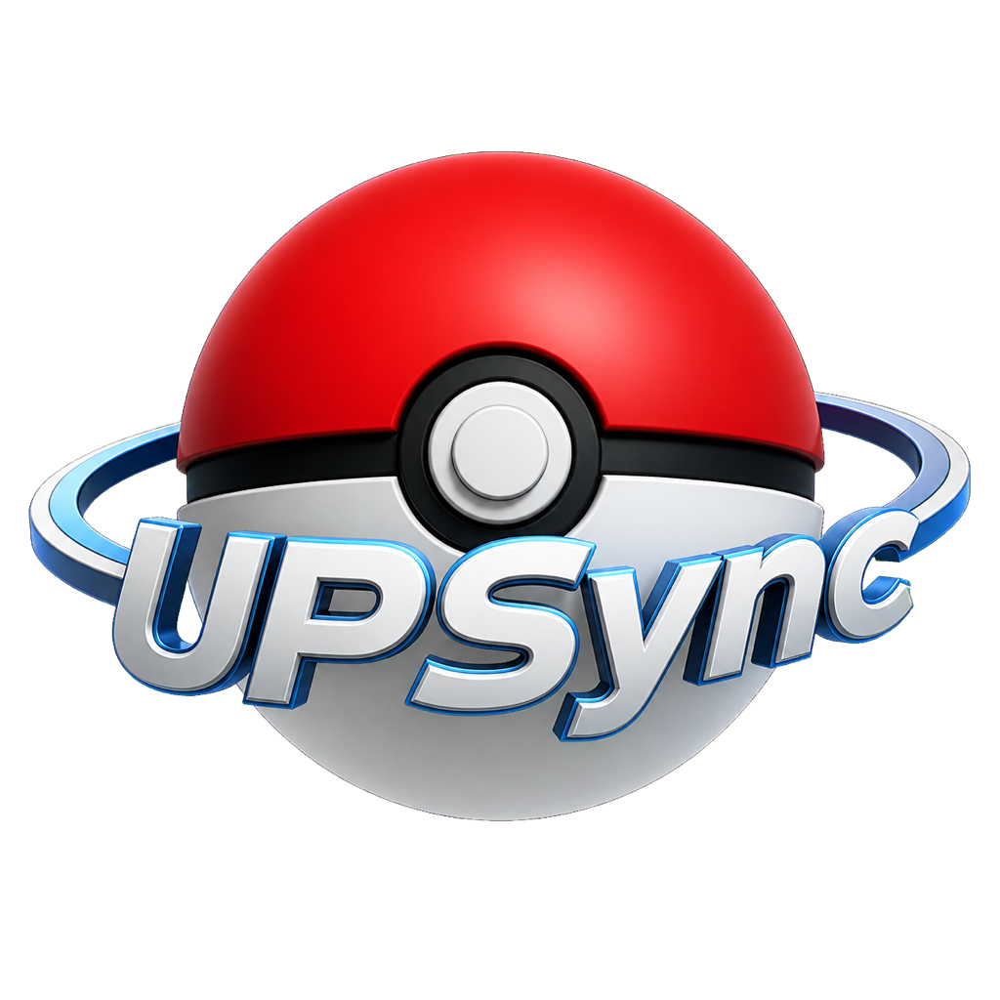

<div align="center">



# UltimatePoKeSync

**Your Pokémon team, analysed live, straight from the emulator's memory.**

No typing anything in. Load a script, play, and the team is on screen — with its type
coverage, its weak points, and what to do about them.

[](https://github.com/ringoliRob/UltimatePoKeSync/actions/workflows/ci.yml)
[](https://github.com/ringoliRob/UltimatePoKeSync/releases)
[](LICENSE)


[Install](#install) · [What it does](#what-it-does) · [How it works](#how-it-works) ·
[From source](#running-from-source) · [Documentation](#documentation)

</div>

---

## What it does

- **Reads your party as you play.** The emulator's memory, decoded in real time. Species,
  level, types, nature, ability, held item, IVs, EVs, moves and PP.
- **Analyses the whole team.** All 17 Gen 3 matchups on both sides, including ability
  effects, and the gaps: what you are weak to with nothing to switch in, and what nothing
  on the team can hit hard.
- **Scores the team, and shows its working.** Party size, level cohesion, coverage, nature
  and effort-value fit — each with the fact behind it and the Pokémon responsible. Never a
  bare number.
- **Suggests, per Pokémon.** Role, nature, effort values, held item, and a four-move set
  with the reason each move earned its slot, plus what it turned down.
- **Two profiles.** *Playthrough* answers for the story, *competitive* for battling. One
  toggle switches every answer.
- **Never touches your game.** Read-only, and no network calls at any point.

Current target: **Gen 3 / Pokémon Emerald** through **mGBA**. The architecture has been
multi-emulator and multi-generation since the first commit.

## Install

Download the file for your system from the [releases page](../../releases), unpack it and
run it. Nothing else to install — the .NET runtime is inside.

| System | File |
| ------ | ---- |
| Windows | `UltimatePoKeSync-windows-x64.zip` |
| macOS, Apple Silicon | `UltimatePoKeSync-macos-apple-silicon.zip` |
| macOS, Intel | `UltimatePoKeSync-macos-intel.zip` |
| Linux | `UltimatePoKeSync-linux-x64.tar.gz` |

**On macOS, move the app into Applications before opening it**, then right-click → Open the
first time. The app is signed ad-hoc rather than by Apple, so that first launch needs your
permission; every launch after it is a normal double-click.

The app opens on a setup screen with the steps for your system and the path of the bridge
script to load into mGBA, with a button that reveals it in your file manager. Once the
script is running, the team appears by itself.

<details>
<summary>macOS says the app is “damaged and should be moved to the Trash”</summary>

The download predates `v0.1.1` and carries no signature at all, which Apple Silicon refuses
to run. Take a newer release, or repair the copy you have:

```bash
xattr -dr com.apple.quarantine /path/to/UltimatePoKeSync.app
codesign --force --deep --sign - /path/to/UltimatePoKeSync.app
```

</details>

<details>
<summary>The app never connects</summary>

The bridge script has to be loaded inside mGBA — `Tools` → `Scripting…` → `File` →
`Load script…` — and mGBA keeps it running only while that window is open. Check mGBA's
scripting console for errors, and make sure no second copy of mGBA is holding port 8888.

An unrecognised ROM produces no messages at all, deliberately: the script refuses to read a
memory map it does not know rather than invent Pokémon. The supported game codes are the
nine Western Gen 3 releases — Emerald in five languages, FireRed, LeafGreen, Ruby and
Sapphire.

</details>

## Requirements

- mGBA 0.10.5 or later — Lua scripting exists from 0.10.0
- A Gen 3 ROM you own. None is included, and none ever will be
- The .NET 10 SDK, only if you build from source

## How it works

```
mGBA + Lua script  --TCP 127.0.0.1:8888-->  .NET app  -->  PKHeX.Core  -->  analysis  -->  Avalonia UI
   (raw bytes)                               (client)      (parsing)
```

The Lua script interprets nothing: it ships the raw party bytes and the game identity, and
transmits only when they actually change. All decoding happens on the C# side. Adding
another emulator costs a new script and zero lines of domain logic.

## Running from source

```bash
dotnet run --project src/UltimatePoKeSync.App   # the dashboard
dotnet run --project src/UltimatePoKeSync.Cli   # the diagnostic console
```

Either way, load [`emulator-scripts/mgba/ups_bridge.lua`](emulator-scripts/mgba/ups_bridge.lua)
in mGBA through `Tools` → `Scripting…` → `File` → `Load script…`, with the ROM loaded before
or after — it does not matter.

The console takes `--analyze` for team coverage and `--recommend playthrough` (or
`competitive`) for per-Pokémon suggestions. `--replay <fixture.json>` renders a snapshot
dumped with `--dump` and exits, so the whole chain can be checked with no emulator running:

```bash
dotnet run --project src/UltimatePoKeSync.Cli -- \
  --replay tests/UltimatePoKeSync.Parsing.Tests/Fixtures/emerald-it-treecko.json \
  --analyze --recommend playthrough
```

More detail and troubleshooting:
[`emulator-scripts/mgba/README.md`](emulator-scripts/mgba/README.md).

## Layout

| Path                      | Contents |
| ------------------------- | -------- |
| `emulator-scripts/mgba/`  | Lua script that reads RAM and ships it over TCP |
| `src/…Contracts/`         | The architectural boundary: raw bytes, not Pokémon. Zero dependencies |
| `src/…Providers.MGba/`    | TCP client with reconnect. Knows nothing of PKHeX or game rules |
| `src/…Parsing/`           | Bytes → Pokémon via PKHeX |
| `src/…GameData/`          | Per-generation type chart, natures, heuristics |
| `src/…GameData.Learnsets/`| Per-game level-up learnsets, read from PKHeX |
| `src/…Analysis/`          | Team coverage, roles, strength, suggestions |
| `src/…Cli/`               | Headless diagnostic console |
| `src/…App/`               | Avalonia dashboard |

## Documentation

- [`docs/HANDOFF.md`](docs/HANDOFF.md) — current state, environment quirks, what works and
  what is next. Read this first if you are picking the project up.
- [`docs/DECISIONS.md`](docs/DECISIONS.md) — every design choice, with the alternatives
  considered and the reasoning. The authority on why anything is the way it is.
- [`docs/protocol.md`](docs/protocol.md) — the emulator-to-app protocol.

## Licence

GPLv3. See [`LICENSE`](LICENSE).

The project uses [PKHeX.Core](https://github.com/kwsch/PKHeX) (GPL-3.0-or-later) to parse
Pokémon data structures; its copyleft extends through linking, so the whole app is GPLv3.
See D-007 in the decision log.

Pokémon is a trademark of Nintendo, Creatures Inc. and GAME FREAK Inc. This project is a
fan tool, unaffiliated with them, and ships no ROM, no save data and no assets extracted
from a game.
