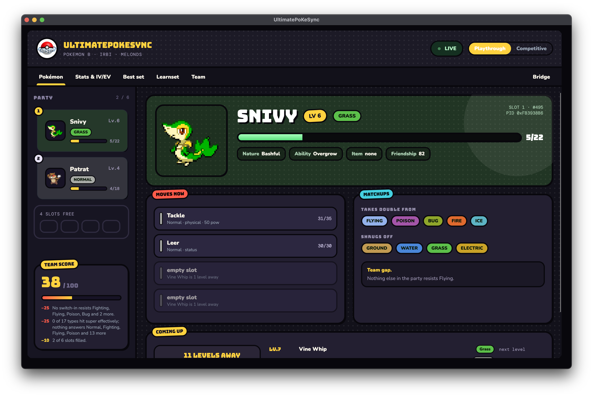
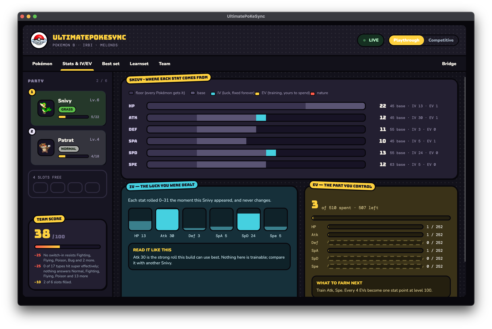
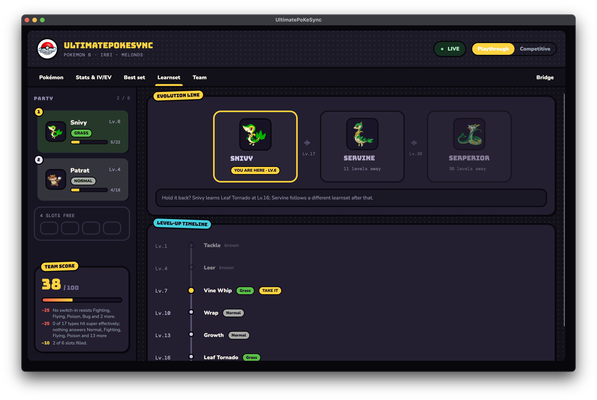
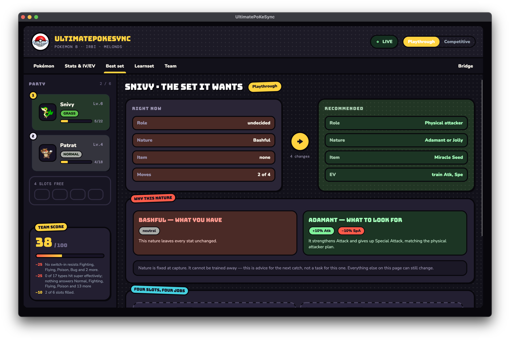
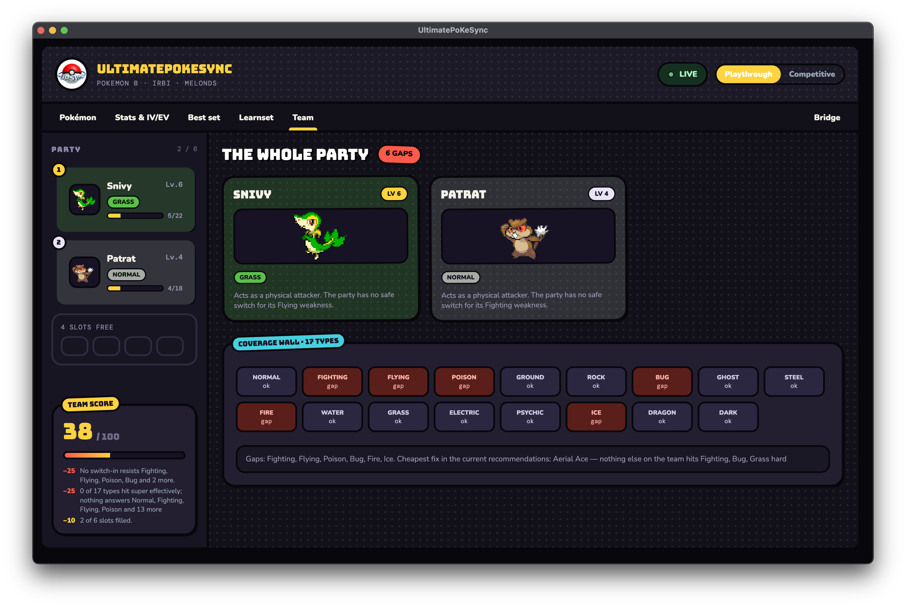

<div align="center">


# UltimatePoKeSync

**Reads your Pokémon party live from the emulator and explains it while you play.**

There is nothing to type in. Start the game and your party appears on screen: what it is
weak to, what it cannot hit, what the next levels bring, and where each number comes from.

[](https://github.com/ringoliRob/UltimatePoKeSync/actions/workflows/ci.yml)
[](https://github.com/ringoliRob/UltimatePoKeSync/releases)
[](LICENSE)


[Install](#install) · [Learning by playing](#learning-by-playing) · [What it does](#what-it-does) ·
[Sprites](#sprites) · [How it works](#how-it-works) · [Documentation](#documentation)



</div>

---

## Learning by playing

The games explain very little of their own mechanics. They do not tell you that a Snivy
takes double damage from Flying, that its IVs were rolled the moment you met it and can
never change, that its nature is costing it Speed, or that four EVs are worth one point at
level 100.

This app supplies that explanation for the Pokémon you are actually carrying. It reads your
party and, next to every number, says where the number came from.

- **A stat has five parts.** The floor every Pokémon of that level gets, the base stat of
  its species, its IVs, its EVs, and its nature. Only the last two can still be changed.
- **Luck and effort are separate.** IVs are drawn once and fixed. EVs are the part you
  control, capped at 510 in total and 252 per stat.
- **Type matchups against your own team.** Not a chart to memorise: the types nothing in
  your party resists, and the types nothing of yours hits hard, with the Pokémon
  responsible named.
- **What is coming.** The next level-up moves, how far away they are, and what your Pokémon
  evolves into.
- **Advice with its reasons.** Every recommended move says why it earned the slot and how
  to obtain it. Every rejected one says why it lost.

### Stats and IV/EV: where a number comes from



A level 6 Snivy has 22 HP. Sixteen of those are the floor any Pokémon of that level gets and
only six come from being a Snivy, so the bar draws them as two different segments rather
than calling the whole thing "base". Beside it are the IVs it was dealt and the EVs still
left to spend, labelled as the two different things they are.

### Learnset: what the next levels bring



The evolution line with the level of each step, and the moves still ahead on a timeline.
Nothing is promised past the evolution, because from then on the Pokémon follows a different
learnset. When holding it back buys a move, the app says so.

### Best set: what to change, and what you cannot



What the Pokémon has now beside what it wants, with the differences counted. The nature
block explains what your nature is costing and then states that nature is fixed at capture:
advice for the next catch, not a task for this one.

### Team: the wall of seventeen types



Every type your party can answer and every one it cannot, with the gaps named and the
cheapest fix taken from the recommendations already on screen.

If you already know all this, the same screens work as a fast read on a team you are
building.

## What it does

- **Reads your party as you play.** Emulator memory, decoded live: species, level, types,
  nature, ability, held item, IVs, EVs, moves and PP, plus the current state of the fight:
  hit points, poison, burn, sleep.
- **Watches two emulators at once.** mGBA for Game Boy Advance and melonDS for Nintendo DS.
  You are never asked which one you are using: whichever answers is the one shown, and
  switching games mid-session needs no announcement.
- **Six screens.** Pokémon, Stats and IV/EV, Best set, Learnset, Team, Bridge.
- **Scores the team and shows its working.** Party size, level cohesion, coverage, nature
  and effort-value fit, each with the fact behind it rather than a bare number.
- **Animated sprites** from a folder on your own disk, fetched with one click. Nothing is
  bundled, because the artwork is Nintendo's.
- **Skips eggs.** An egg holds a party slot but cannot battle, so it stays out of the team's
  coverage and score, and the app will not tell you what is inside it.
- **Never writes to your game.** Read-only. The only network call in the app is the sprite
  download, and only when you press the button.

### Where it has actually been run

The app refuses games it has not been mapped for rather than reading a memory map it does
not know. What has been verified against a real cartridge:

| Generation | Emulator | Verified live |
| --- | --- | --- |
| Gen 3 | mGBA | Emerald, Ruby, Sapphire, FireRed, LeafGreen (Italian) |
| Gen 5 | melonDS | Black (Italian) |

Thirteen Gen 3 game codes are supported on cross-checked addresses; eight of them have never
been loaded by anyone. Gen 5 currently maps one code. If you own another, loading it and
reporting what happened is the most useful thing you can contribute. Two of the five Gen 3
games needed a code change the first time they were run, because an Italian cartridge keeps
its party sixteen bytes away from where the American one does.

## Install

Download the file for your system from the [releases page](../../releases), unpack it and
run it. There is nothing else to install: the .NET runtime is inside.

| System | File |
| ------ | ---- |
| Windows | `UltimatePoKeSync-windows-x64.zip` |
| macOS, Apple Silicon | `UltimatePoKeSync-macos-apple-silicon.zip` |
| macOS, Intel | `UltimatePoKeSync-macos-intel.zip` |
| Linux | `UltimatePoKeSync-linux-x64.tar.gz` |

**On macOS, move the app into Applications before opening it**, then right-click → Open the
first time. The app is signed ad-hoc rather than by Apple, so that first launch needs your
permission. Every launch after it is a normal double-click.

### Connecting the emulator

The app shows the steps for whichever machine you are playing on and picks up the first one
that answers.

**Game Boy Advance, mGBA 0.10.5 or later.** Open `Tools` → `Scripting…` → `File` →
`Load script…` and load the bridge script. The app prints its exact path and has a button
that reveals it in your file manager. mGBA runs the script only while that window stays
open.

**Nintendo DS, melonDS 1.1 or later.** No script is needed. Open `Config` → `Emu settings`,
tick **Enable GDB stub** and leave the JIT recompiler off (melonDS ships with it off, and
the debugger only answers when it is), then restart the game.

<details>
<summary>The app never connects</summary>

An unrecognised ROM produces nothing, deliberately: the app refuses a memory map it does not
know rather than invent Pokémon.

On mGBA, check the scripting console for errors and make sure no second copy is holding port
8888. On melonDS, check that the GDB stub is ticked and the JIT is off. If a previous client
died without disconnecting cleanly, one of melonDS's two debug stubs can be left wedged; the
app tries both, and reloading the ROM clears it.

</details>

<details>
<summary>macOS says the app is “damaged and should be moved to the Trash”</summary>

The download predates `v0.1.1` and carries no signature at all, which Apple Silicon refuses
to run. Take a newer release, or repair the copy you have:

```bash
xattr -dr com.apple.quarantine /path/to/UltimatePoKeSync.app
codesign --force --deep --sign - /path/to/UltimatePoKeSync.app
```

</details>

## Sprites

The app ships no Pokémon artwork, because it is not ours to distribute. It reads what you
already have.

Press **Download sprites** in the app: roughly 27 MB of animated Black and White sprites
covering every species from the first generation to the fifth, fetched into the app's own
folder. There is nothing to configure afterwards, and the team redraws itself when they
arrive.

From a clone of the repository there is a script instead, with more control:

```bash
python3 tools/fetch-sprites.py              # 27 MB, every species, Gen 1 to 5
python3 tools/fetch-sprites.py --up-to 386  # Gen 1 to 3 only, 13 MB
python3 tools/fetch-sprites.py --shiny      # add the shiny ones, 27 MB more
```

Without any of it you get a coloured tile per Pokémon and everything else is identical.

On a Game Boy Advance game the app can also read the sprites straight out of your own
cartridge, and does when the folder has none. A DS cartridge is not mapped into memory, so
there is nothing to read there, which is why the folder exists.

## Requirements

- mGBA 0.10.5 or later, or melonDS 1.1 or later
- A ROM you own. None is included, and none ever will be
- The .NET 10 SDK, only if you build from source

## How it works

```
mGBA + Lua script  --TCP 8888-->
                                 .NET app --> PKHeX.Core --> analysis --> Avalonia UI
melonDS GDB stub   --TCP 3333/4-->            (parsing)     (rules)
```

Neither emulator side interprets anything. They hand over raw bytes and the game's own
identity, read from the cartridge header, and all decoding happens in C#. The Lua script
sends only when the party actually changes; melonDS answers questions, so the app asks once
a second.

Everything above the provider is generation-aware rather than generation-specific. The
physical/special split belongs to the move from Gen 4 onwards and to the type before it, and
each generation carries its own move data, learnsets and evolution table.

## Running from source

```bash
dotnet run --project src/UltimatePoKeSync.App   # the dashboard
dotnet run --project src/UltimatePoKeSync.Cli   # the diagnostic console
```

The console takes `--analyze` for team coverage and `--recommend playthrough` (or
`competitive`) for per-Pokémon suggestions. `--replay <fixture.json>` renders a snapshot
dumped with `--dump` and exits, so the whole chain can be checked with no emulator running:

```bash
dotnet run --project src/UltimatePoKeSync.Cli -- \
  --replay tests/UltimatePoKeSync.Parsing.Tests/Fixtures/black-it-snivy.json \
  --analyze --recommend playthrough
```

More detail and troubleshooting:
[`emulator-scripts/mgba/README.md`](emulator-scripts/mgba/README.md).

An experimental standalone reader for opponent Pokémon in USA/Australia SoulSilver is also
available. It does not add Gen 4 to the dashboard; see the
[`SoulSilver opponent beta guide`](docs/SOULSILVER-OPPONENT-BETA.md).

## Layout

| Path                        | Contents |
| --------------------------- | -------- |
| `emulator-scripts/mgba/`    | Lua script that reads RAM and ships it over TCP |
| `src/…Contracts/`           | The architectural boundary: raw bytes, not Pokémon. Zero dependencies |
| `src/…Providers.MGba/`      | TCP client with reconnect, for Game Boy Advance |
| `src/…Providers.MelonDs/`   | GDB remote protocol client, for Nintendo DS |
| `src/…Parsing/`             | Bytes to Pokémon via PKHeX, per generation |
| `src/…GameData/`            | Per-generation type charts, natures, move data, rules |
| `src/…GameData.Learnsets/`  | Per-game learnsets and evolutions, read from PKHeX |
| `src/…Analysis/`            | Team coverage, roles, strength, progress, suggestions |
| `src/…Cli/`                 | Headless diagnostic console |
| `src/…App/`                 | Avalonia dashboard |
| `tools/`                    | Sprite fetcher, data importers, emulator measurements |

## Documentation

- [`docs/HANDOFF.md`](docs/HANDOFF.md): current state, environment quirks, what works and
  what is next. Read this first if you are picking the project up.
- [`docs/DECISIONS.md`](docs/DECISIONS.md): every design choice, with the alternatives
  considered and the reasoning. The authority on why anything is the way it is.
- [`docs/protocol.md`](docs/protocol.md): the emulator-to-app protocol.
- [`docs/SOULSILVER-OPPONENT-BETA.md`](docs/SOULSILVER-OPPONENT-BETA.md): setup,
  test cases, diagnostics and known limitations for the standalone SoulSilver reader.

## Licence

GPLv3. See [`LICENSE`](LICENSE).

The project uses [PKHeX.Core](https://github.com/kwsch/PKHeX) (GPL-3.0-or-later) to parse
Pokémon data structures; its copyleft extends through linking, so the whole app is GPLv3.
See D-007 in the decision log. Third-party data and fonts are listed in
[`THIRD_PARTY_NOTICES.md`](THIRD_PARTY_NOTICES.md).

Pokémon is a trademark of Nintendo, Creatures Inc. and GAME FREAK Inc. This project is a
fan tool, unaffiliated with them, and ships no ROM, no save data and no artwork from a game.
